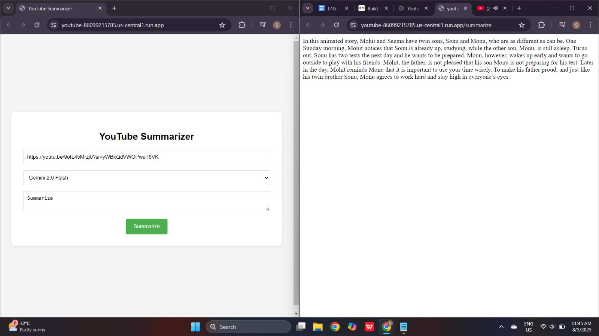

# YouTube Video Summarizer 🎥📝

A **Flask-based web application** that uses **Google Vertex AI** to generate concise summaries of YouTube videos.  
Deployed on **Google Cloud Run** with Docker for scalable, cloud-based AI content generation.

---

## 🚀 Features
- Accepts a YouTube video link from the user.
- Uses Google Vertex AI Generative models to process the video and generate a text summary.
- Supports optional custom prompts for tailored summaries.
- Cloud-deployed with Docker for seamless scalability.
- Simple, user-friendly web interface.

---

## 🛠️ Tech Stack
- **Backend:** Python, Flask
- **AI/ML:** Google Vertex AI (Generative AI API)
- **Frontend:** HTML, CSS (Jinja2 templates)
- **Cloud Deployment:** Google Cloud Run
- **Containerization:** Docker

---

## 📂 Project Structure
├── app.py # Main Flask application

├── requirements.txt # Python dependencies

├── templates/ # HTML templates (index page)

├── static/ # CSS, images, and static files

├── Dockerfile # Container build configuration

├── Procfile # Deployment config

└── README.md # Project documentation

---

## ⚙️ Setup & Installation

### 1️⃣ Clone the repository

```bash
git clone https://github.com/Sathwik231012/youtube-video-summarizer.git
cd youtube-video-summarizer
```

### 2️⃣ Install dependencies

```bash
python -m pip install -r requirements.txt
```

### 3️⃣ Authenticate with Google Cloud

```bash
gcloud auth application-default login
gcloud config set project lucid-sweep-468105-b4
```

### 4️⃣ Run the application locally

```bash
python app.py
```

Access it at http://127.0.0.1:8080

## 🖼️ Screenshots

Here’s how the app looks when generating a summary:


